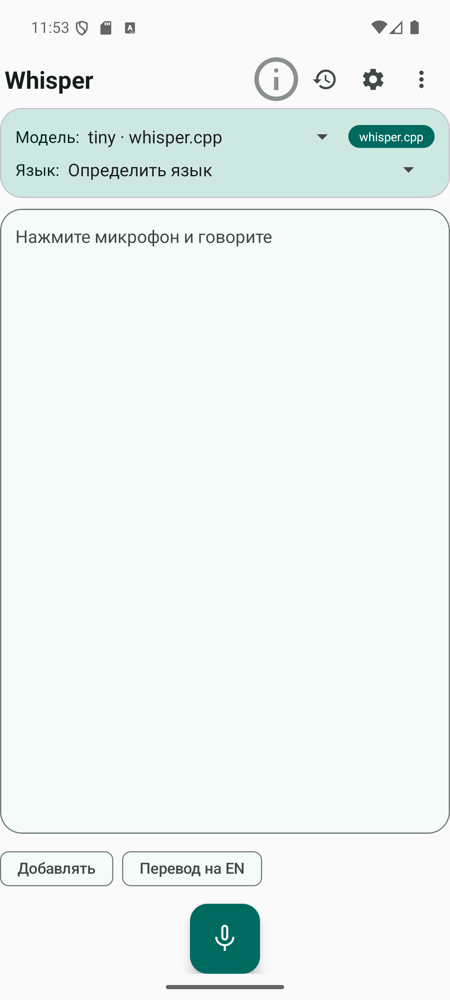
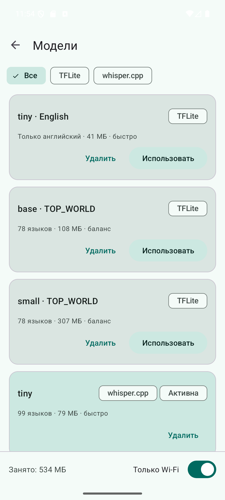
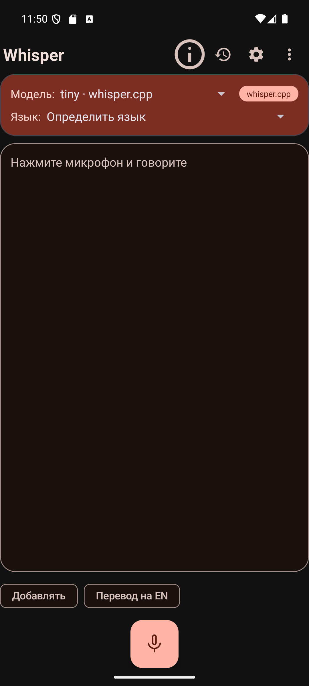
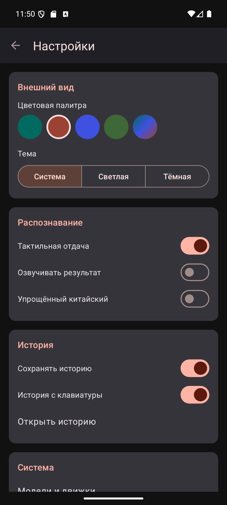
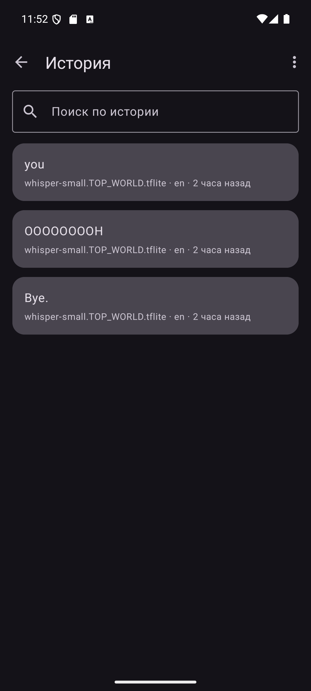
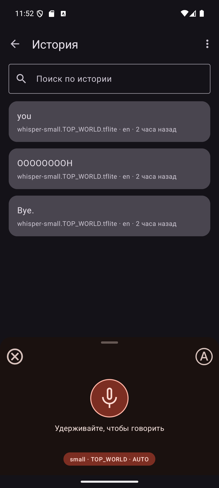

# WhisperIME

**Beautiful offline voice-to-text for Android — Whisper on-device, two engines, zero cloud.**

WhisperIME turns speech into text entirely on your phone. It works as a standalone app,
as a system-wide keyboard (IME), and as your device's voice input service — all backed by
OpenAI's Whisper models running locally. Nothing you say ever leaves the device.

This is a redesigned fork of [woheller69/whisperIME](https://github.com/woheller69/whisperIME)
with a Material You interface, a second inference engine (whisper.cpp), a model catalog,
unlimited dictation, and recognition history.

     

## Features

- **Fully offline.** Recognition runs on-device. The only time the internet permission is
  used is to download the model you choose.
- **Two engines, one abstraction.** TensorFlow Lite (the original models) and whisper.cpp
  (GGUF models) behind a common interface — the model you pick decides the engine.
- **Model catalog.** Eight models with per-model download, resume, cancel and delete,
  progress and speed, an optional Wi-Fi-only guard, and a storage summary.
- **Unlimited dictation.** No 30-second cap: voice activity detection splits speech at
  pauses into chunks, transcribed sequentially and appended as you go (pseudo-streaming).
- **Recognition history** with search, copy, share and delete. Privacy-first: password
  fields are never recorded, and keyboard logging is a toggle you control.
- **Material You.** Four hand-tuned palettes (Teal, Terracotta, Indigo, Forest) plus
  dynamic color (Monet) on Android 12+, with light / dark / system themes.
- **Three surfaces.** Standalone app, input method editor (e.g. via the microphone button
  in [HeliBoard](https://github.com/Helium314/HeliBoard)), and system voice input
  (`RecognitionService`) — plus a redesigned recognition bottom-sheet.
- **Quick access.** A Quick Settings tile, a home-screen widget, and a "Dictate" action in
  the text-selection menu (`ACTION_PROCESS_TEXT`).
- **Onboarding** for first run, a redesigned IME strip, and a translate-to-English mode in
  the standalone app.
- **Localized** in English and Russian.

## Models

| Model | Engine | Size | Languages |
|---|---|---|---|
| tiny · English | TFLite | 41 MB | English only |
| base · TOP_WORLD | TFLite | 108 MB | 78 |
| small · TOP_WORLD | TFLite | 307 MB | 78 |
| tiny | whisper.cpp | 75 MB | 99 |
| base | whisper.cpp | 142 MB | 99 |
| small | whisper.cpp | 466 MB | 99 |
| medium · Q5 | whisper.cpp | 514 MB | 99 |
| large-v3-turbo · Q5 | whisper.cpp | 547 MB | 99 |

TFLite models come from [DocWolle/whisper_tflite_models](https://huggingface.co/DocWolle/whisper_tflite_models);
GGUF models from [ggerganov/whisper.cpp](https://huggingface.co/ggerganov/whisper.cpp). Both
are hosted on Hugging Face and downloaded on demand.

## Tips

- Press and hold the button while speaking, or use auto mode where available.
- Pause briefly before you start speaking.
- Speak clearly, loudly, and at a moderate pace.

## Build

Requirements:

- **JDK 17+** — easiest via the JBR bundled with Android Studio.
- **Android SDK**, plus the **NDK** and **CMake** (needed to compile the whisper.cpp engine).
- The **whisper.cpp** submodule.

```sh
git clone https://github.com/danscMax/whisperIME.git
cd whisperIME
git submodule update --init --recursive
./gradlew assembleDebug
```

The APK lands in `app/build/outputs/apk/debug/`.

## Credits & licenses

This work is licensed under the **MIT license**. It is a fork of
[woheller69/whisperIME](https://github.com/woheller69/whisperIME) (© woheller69), which is
based on the [Whisper-Android project](https://github.com/vilassn/whisper_android).

- [OpenAI Whisper](https://github.com/openai/whisper) — MIT license. Details on Whisper are
  in the [paper](https://arxiv.org/abs/2212.04356).
- [whisper.cpp](https://github.com/ggml-org/whisper.cpp) by ggml-org — MIT license.
- [Android VAD](https://github.com/gkonovalov/android-vad) — MIT license.
- [Opencc4j](https://github.com/houbb/opencc4j) for Chinese conversions — Apache-2.0 license.
- TFLite models from [DocWolle/whisper_tflite_models](https://huggingface.co/DocWolle/whisper_tflite_models) — MIT license.
- GGUF models from [ggerganov/whisper.cpp](https://huggingface.co/ggerganov/whisper.cpp) on Hugging Face.

## Contribute

For translations, use https://toolate.othing.xyz/projects/whisperime/
</content>
</invoke>
